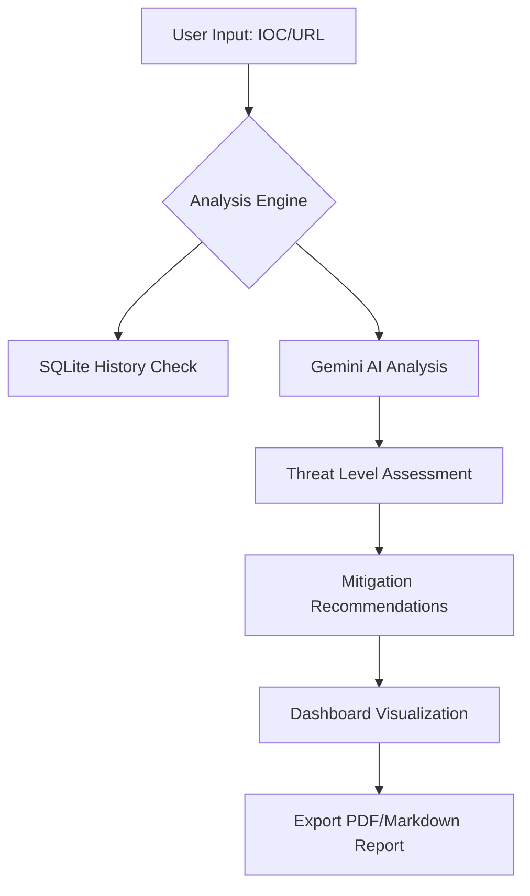

# Sentinel Intelligence - AI Threat Analysis System

## Project Overview
Sentinel Intelligence is a comprehensive Cyber Threat Intelligence (CTI) platform designed for the role of a **Threat Intelligence Intern**. It provides tools for analyzing Indicators of Compromise (IOCs), tracking threat actors, and monitoring global security trends using advanced AI analysis.

## Core Modules
1. **Threat Actor Research**: A database of known APT groups and cybercriminals with their TTPs (Tactics, Techniques, and Procedures).
2. **IOC Analysis Engine**: AI-powered analysis of IPs, Domains, and File Hashes to determine maliciousness and provide mitigation steps.
3. **Phishing Detection**: A specialized tool for verifying suspicious URLs and email domains.
4. **Threat Trend Monitoring**: Visualization of emerging cybersecurity trends and their impact levels.
5. **Intelligence Dashboard**: Real-time overview of system activity and global threat stats.

## System Architecture
- **Frontend**: React 19 with Tailwind CSS 4.0 for a modern, high-density technical dashboard.
- **Backend**: Express.js server managing API routes and Vite middleware.
- **Database**: SQLite (via `better-sqlite3`) for persistent storage of actors, trends, and analysis history.
- **AI Engine**: Google Gemini 3.1 Flash for deep contextual analysis of threats and report generation.

## Internship Context: Real-World Tasks
This project helps a Threat Intelligence Intern perform the following real-world tasks:
- **Triage**: Quickly identifying if an IOC found in logs is a known threat.
- **Actor Attribution**: Mapping attack techniques to known threat groups.
- **Reporting**: Generating structured intelligence reports for stakeholders.
- **Trend Analysis**: Staying ahead of the curve by monitoring emerging attack vectors like Ransomware 2.0.

## Workflow Diagram

## Setup Instructions
1. **Environment Variables**: Ensure `GEMINI_API_KEY` is set in your environment.
2. **Installation**: Run `npm install` to install dependencies.
3. **Development**: Run `npm run dev` to start the Express server and Vite frontend.
4. **Database**: The system automatically initializes `threat_intel.db` on first run.

## Sample Dataset
The system comes pre-seeded with:
- **Actors**: Lazarus Group, Fancy Bear (APT28), Wizard Spider.
- **Trends**: Ransomware 2.0, Supply Chain Attacks, AI-Enhanced Phishing.
